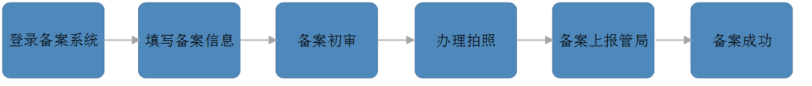

<properties
	pageTitle="ICP 备案 | Azure"
	description="ICP 备案原因及备案流程介绍"
	services="icp"
	documentationCenter=""
	authors=""
	manager=""
	editor=""
	tags="icp"/>

<tags
	ms.service="icp"
	ms.workload=""
	ms.tgt_pltfrm=""
	ms.devlang="na"
	ms.topic="article"
	ms.date="03/2017"
	wacn.date="03/2017"
	wacn.lang="cn" 
	ms.author=""/>

# ICP 备案

## 为什么要备案

根据工信部的《互联网信息服务管理办法》，以及《非经营性互联网信息服务备案管理办法》规定，所有在中国大陆境内运行的网站（凡涉及到域名解析的）必须进行 ICP 备案。并且通信管局规定，未备案的域名不能上线，且已经备案的域名需要解析到已备案的 IP。

 
 

## 备案流程

 
 
温馨提示：

根据《计算机信息网络国际联网安全保护管理办法》（公安部第 33 号令）第十二条规定，各网站在工信部备案成功之后，需在网站开通 30 日内到公司实际经营地或个人现居住地公安机关履行公安备案手续。如未办理公安备案手续，请尽快登录<a id="icp_beian" href="http://www.beian.gov.cn/portal/index">全国公安机关互联网站安全管理服务平台</a>提交公安备案申请。如需咨询公安备案事宜请联系属地公安机关网安部门。如您备案属地为上海，请您按照以上通知要求尽快办理网站公安备案，如超过 30 日未办理的，将依据法律法规及公安机关要求规落实相关处置措施（包括但不限于暂停接入服务等），谢谢您的理解与配合！

前往<a id="icp_public-security-registration" href="/support/announcement/public-security-registration/">公安备案</a>页面了解更多详情。
