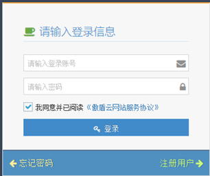
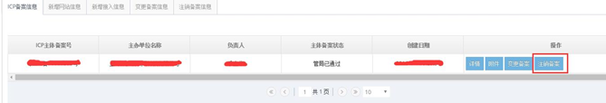
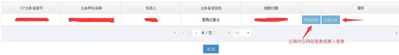
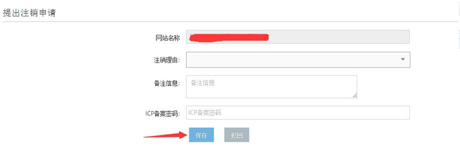
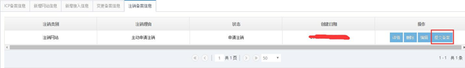
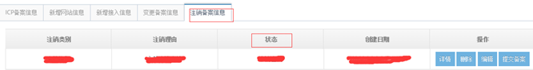

<properties
	pageTitle="原备案在蓝云-备案注销 | Azure"
	description="ICP 备案类型为原备案在蓝云的备案注销操作流程"
	services="icp-backup"
	documentationCenter=""
	authors="will"
	manager="edwinc"
	editor=""
	tags="icp"/>

<tags
	ms.service="icp-backup"
	ms.workload=""
	ms.tgt_pltfrm=""
	ms.devlang="na"
	ms.topic="article"
	ms.date="02/2017"
	wacn.date="02/2017"
	wacn.lang="cn" 
	ms.author="will"/>
	
	
# ICP 备案操作解析

## 备案类型

首次备案 
原备案在蓝云：新增网站，备案变更，备案注销 
原备案不在蓝云：新增网站，新增接入
 
 

## 备案的具体操作

1、各省管局对备案的要求 
在进行备案前请先了解自己所属管局的备案要求，对您的备案能够顺利通过管局审核会有很大帮助。 
[各省管理局特殊要求下载](//wacndevelop.blob.core.chinacloudapi.cn/marketing-resource/documents/special-request.pdf)
 

2、备案具体操作 
2.1 登录账号 
登录网站 [http://icp.cloud.21vianet.com](http://icp.cloud.21vianet.com)，输入账号密码，点击登录。

 

2.2 注销备案 
若已经备案成功的信息需要删除，可以进行注销备案的操作。先在首页中选择“注销备案” 。

在跳转页面中选择对应注销项

确认注销类型后填写相关信息并“保存”

回到主页面的“注销备案信息”选项卡中提交备案即可。

 

2.3 备案信息提交后的备案操作 
 1. 提交备案后我们会在 2 个工作日内进行审核，并以邮件或电话和您沟通有关信息资料的具体问题，请保持电话畅通并及时查看邮件。 
 2. 备案成功后，管局将邮件和短信通知主办单位负责人。 
 附：部分省份管局审核周期预估，最终审核时间以管局为准 
 3 周：甘肃、云南 
 2 周：北京、四川、湖北、天津、江西、广西 
 1 周：广东、江苏、浙江、河南、陕西、安徽、福建、贵州、辽宁 
 3 天：重庆、上海 
 3. 提交备案信息之后，您可以在相应的备案类型模块内查询备案进度。   
 4. 如果管局审核未通过，我们会电话和邮件与您沟通，告知原因并协助您再次上报信息资料，请保持电话畅通并及时查看邮件。
