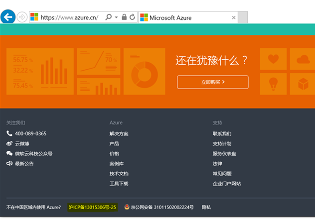

<properties
	pageTitle="Global Customer Playbook envisioning-guidance-parity"
	description="Global Customer Playbook envisioning-guidance-parity"
	services="global-customer-playbook"
	documentationCenter=""
	authors="jtong"
	manager="edwinc"
	editor=""
	tags="global-customer-playbook"/>

<tags
	ms.service="migration-lifecycle-envisioning"
	ms.workload=""
	ms.tgt_pltfrm=""
	ms.devlang="na"
	ms.topic="article"
	ms.date="11/21/2016"
	wacn.date="11/21/2016"
	wacn.lang="en"
	ms.author="jtong"/>

# Envisioning Guidance - Policies

[AZURE.INCLUDE [header](../../../../mktcontent/includes/envisioning-guidance.md)]

## ICP Licenses

According to the "Internet Information Services" regulation, the "non-commercial Internet information service record management" regulation, and the other regulations promulgated by the Ministry of China, the government has enforced all non-commercial Internet information services to strictly follow the ICP (Internet Content Provider) registration and filing process.
 
To obtain an ICP license from China's Ministry of Industry and Information Technology (MIIT), you must follow the ICP registration and filing process. Before you begin the process, you must first have a legal presence in China, and you should have your own ICP license for your website.
 
You should not attempt to share ICP licenses with Chinese partners, this will lead to problems with the regulators. There are local firms in China that can provide ICP licenses and web hosting for foreign firms, but in reality this is against the policies, because without the client owning a Chinese business entity this is not currently possible. In addition, if several businesses attempt to piggyback on a provider's ICP license, it can present several problems.
 
Sharing an ICP license is against government rules and regulations, meaning that the provider (and the websites hosted with them) could be shut down at any time, without any notice whatsoever.  Also, when you share an ICP license illegally like this and your entire online presence in China - your website, its hosting and the domain name itself - is owned and controlled by another company, and if this company goes out of business or simply chooses to pull the plug at any time, you will be left with little or no legal recourse.
 
Getting an ICP license is an additional step that is taken after you purchase your hosting and domain name, but before your site goes live. ICP license numbers are usually displayed in the small print in website footers, and should be displayed on your website at all times. Below is a sample of the ICP license number for China Azure displayed at the bottom of the home page.

## Data Auditing

Based on your ICP registered domain and hosting location, MIIT and related governmental authorities should within their respective areas of responsibility, and according to the law, implement supervision and management of your Internet content. They reserve the right to audit your web site by examining your servers and data, at your actual hosting location and at any time if needed.

Let's move to the next section - [Parity](/solutions/global-customer/envisioning/guidance/parity).
