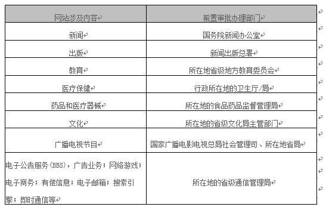

<properties
	pageTitle="为什么要备案及备案流程 | Azure"
	description="ICP 备案及备案流程"
	services="global-customer-playbook"
	documentationCenter=""
	authors="will"
	manager="edwinc"
	editor=""
	tags="global-customer-playbook"/>

<tags
	ms.service="global-customer-playbook"
	ms.workload=""
	ms.tgt_pltfrm=""
	ms.devlang="na"
	ms.topic="article"
	ms.date="01/18/2017"
	wacn.date="01/18/2017"
	wacn.lang="cn" 
	ms.author="will"/>

# ICP备案操作解析

## 热点问题

### 1. ICP 许可证和 ICP 备案是什么？如果我在 Azure 上部署我的服务，我需要 ICP 许可证或者 ICP 备案么？
ICP 备案是工信部要求每一个在国内连接互联网的网站都必须要办的一个入网许可。ICP 许可证是网站经营的许可证，根据国家《互联网信息服务管理办法》规定，经营性网站必须办理 ICP 许可证，否则就属于非法经营。

如果您在 Azure 平台上部署了网站，请登录上海蓝云网络科技有限公司备案系统 http://icp.cloud.21vianet.com 进行相关备案。
是否需要办理 ICP 许可证，如您根据国家《互联网信息服务管理办法》规定不能判断自己  
是否需要办理 ICP 许可证，请联系当地通信管理局进行确认。

### 2. 备案面签地点？
北京：朝阳区酒仙桥东路 1 号   电话：4000890365 
上海：上海浦东区科苑路 88 号 3 号楼 657 室    电话：4000890365
 
### 3. ICP 备案所需材料？
#### 1. 公司备案：
- 主办者证件：营业执照(企业）、组织机构代码证（仅限非企业机构）
- 网站负责人证件：指公司员工身份证或护照（护照仅限非大陆境内人士）
- 主体负责人证件：指法人身份证或护照（护照仅限非大陆境内人士）
- 网站真实性核验单：登陆备案系统后，在“常用文档下载”中下载
- 网络安全责任书：登陆备案系统后，在“常用文档下载”中下载
- 域名证书：如果域名是在境内注册，请直接联系域名注册商提供信息；如果域名是在境外注册，请在互联网上通过 whois 查询信息并截图
- 法人授权书（仅个别用户需要，请查看“管局特殊要求”）：请在备案系统首页“报备必读”中下载
- 暂住证：仅个别用户需要，请查看“管局特殊要求”

#### 2. 个人备案：
- 主办者+网站负责人+主体负责人：要求是同一人，需提供身份证（非大陆境内人士可以提供护照或台胞证）
- 网站真实性核验单：请在备案系统首页“报备必读”中下载
- 网络安全责任书：请在备案系统首页“报备必读”中下载
- 域名证书：如果域名是在境内注册，请直接联系域名注册商提供信息；如果域名是在境外注册，请在互联网上通过 whois 查询信息并截图
- 暂住证：仅个别用户需要，请查看“管局特殊要求”

#### 3. 注意：以上资料原件拍照或者原件扫描件在备案系统直接上传；面签时请携带“网站真实性核验单+网络安全责任书”原件。

### 4. ICP 备案流程？
您在 “ icp.cloud.21vianet.com ” 进行注册，并填写、提交相关信息，我们初审通过后会通知贵方网站负责人携带相关核验资料到现场进行核验，通过后我们将信息提交到省管局，若审核通过则备案成功。

### 5. ICP 备案周期？
在您提交信息后，我们会在 2 个工作日进行初审；若审核通过，我们会通知您来我们公司进行现场核验；面签通过后，我们会在收到纸质资料和照片后 1.5 个工作日进行二次审核，并将信息提交到省管局，管局会在 20 个工作日内下发审核意见。

### 6. 部分省份管局审核周期预估。（注：最终审核时间以管局为准）
3周：甘肃、云南 
2周：北京、四川、湖北、天津、江西、广西 
1周：广东、江苏、浙江、河南、陕西、安徽、福建、贵州、辽宁 
3天：重庆、上海 

### 7. 备案适用情况？

1. 新增备案：适合首次备案的用户。
2. 新增网站：适合已有 ICP 备案，为同一主办单位新开办的网站或此前未进行过备案的网站进行备案。
3. 新增接入：适合原来在其他服务商处有网站并且已经做过备案的用户，将网站转为我们接入，并且仍使用原来域名的用户。

### 8. 备案登陆账号密码找回发到哪里？

1. 系统升级前注册账号客户:发送到注册联系人邮箱;
2. 系统升级后注册账号客户: 发送到登陆邮箱,即登陆账号（注意：如您在“基本信息设置”添加新邮箱，则默认发到此邮箱中）

### 9. 备案面签通知发给谁？
1. 系统升级前注册账号客户:发送到注册联系人邮箱;
2. 系统升级后注册账号客户:发送到登陆邮箱,即登陆账号（注意：如您在“基本信息设置”添加新邮箱，则默认发到此邮箱中）

### 10. 从哪里获取备案 真实性核验单和网络安全责任书？
备案系统首页,报备必读中。

### 11. 涉及前置审批行业及办理审批部门：教育和医疗保健不需要进行前置审批

### 12. 在备案系统填写备案接入信息，服务器放置地和接入方式如何选择？
服务器放置地：可以选择“北京”或“上海” ；
接入方式：浙江、天津的用户选择“虚拟主机”，其他地区用户选择“其他方式”。

### 13. 域名只做邮箱使用是否需要备案？ 如果顶级域名已经做过备案了，mail 这样的二级域名就不需要再做备案了吧？
备案是根据顶级域名来判断的，只要顶级域名没有备案过，该域名开通任何互联网信息服务都需要备案。所以，只做邮箱的域名也需要备案。
根据顶级域名和二级域名是否在同一家接入商：如同一家，则不需要备案；如不是同一家，则需要对顶级域名做新增接入操作。

### 14. 哪些网站需要备案？ 
用户可以通过独立的域名或独立的 IP 浏览公司在互联网上发布的信息，都需要备案。

### 15. 我只注册了域名，做了转发到一个已经备案的网站上了，我的域名还需要备案吗？ 
需要备案，您需要将域名添加到已经备案的网站信息中。

### 16. 备案成功后, 我是否还可以修改备案信息？
可以修改，但有些内容的修改则需重新提供核验资料。由于目前各省管局的要求不统一，届时可联系客服代表进行确认。

### 17. 备案信息在管局审核中，是否可以修改备案信息？
不可以，管局审核通过后可以修改备案信息，并且备案信息的修改必须要再次提交管局审核才可生效。

### 18. 备案密码忘记如何找回？
备案密码是备案成功后，通信管理管局下发给用户的。如果忘记了，请登录工信部备案网站 www.miitbeian.gov.cn 找回密码，或通过各地通信管理局找回密码。

### 19. 进行什么操作时，会用到管局下发的备案密码？
新增接入、注销主体。

### 20. 我的网站备案成功了，下一步怎么做？
备案成功后，工信部会将备案结果以邮件和短信的形式通知您，您会获得网站的 ICP 备案号和备案密码，请将备案号放到自己的网站上并链接到 www.miitbeian.gov.cn 工信部备案网站上。
