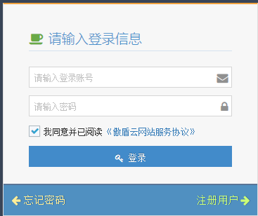
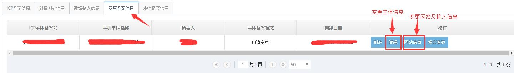
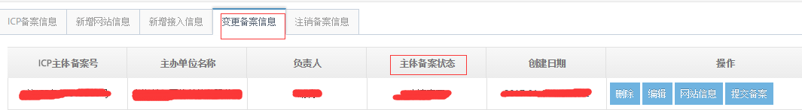

<properties
	pageTitle="为什么要备案及备案流程 | Azure"
	description="ICP 备案及备案流程"
	services="icp-backup"
	documentationCenter=""
	authors="will"
	manager="edwinc"
	editor=""
	tags="icp-backup"/>

<tags
	ms.service="icp-backup"
	ms.workload=""
	ms.tgt_pltfrm=""
	ms.devlang="na"
	ms.topic="article"
	ms.date="01/18/2017"
	wacn.date="01/18/2017"
	wacn.lang="en" 
	ms.author="will"/>
	
	
# ICP 备案操作解析

## 备案类型

- **首次备案** 
- **原备案在蓝云** ：新增网站，备案变更，备案注销
- **原备案不在蓝云** ：新增网站，新增接入
 
 

## 备案的具体操作

### 1、各省管局对备案的要求
在进行备案前请先了解自己所属管局的备案要求，对您的备案能够顺利通过管局审核会有很大帮助。 
[各省管理局特殊要求下载](//wacndevelop.blob.core.chinacloudapi.cn/marketing-resource/documents/special-request.pdf)
 

### 2、备案具体操作
#### 2.1 登录账号
登录网站 [http://icp.cloud.21vianet.com](http://icp.cloud.21vianet.com)，输入账号密码，点击登录。

 

#### 2.2 变更备案
客户可以变更已经通过管局审核的备案信息，但变更必须要再次提交管局审核才可生效，点击首页的“变更备案”后跳转到 “变更备案信息”选项，选择在对应处编辑修改后点击 “提交备案” 即可。
操作备案变更请注意：变更备案时，核验单内网站负责人签字日期有效期为 24 个月，过期需要重新进行面签。

 

#### 2.3 备案信息提交后的备案操作
 1. 提交备案后我们会在 2 个工作日内进行审核，并以邮件或电话和您沟通有关信息资料的具体问题，请保持电话畅通并及时查看邮件。
 2. 初审通过后，我们会邮件通知您下一步操作，请按邮件要求完成拍照，并携带“网站真实性核验单+网络安全责任书”原件到蓝云面签或自制幕布拍照并邮寄资料。
 3. 面签地址： 
    北京（同时也是资料邮件地址）：朝阳区酒仙桥东路 1 号   电话：4000890365 
    上海：上海浦东区科苑路 88 号 3 号楼 657 室    电话：4000890365
 4. 我们收到纸质备案材料和照片后会在 1.5 个工作日内进行审核，审核期间如遇到问题，我们会电话和邮件与您沟通有关信息资料的具体问题，请保持电话畅通并及时查看邮件。当您的信息准确无误时，我们将直接上报管局。
 5. 备案成功后，管局将邮件和短信通知主办单位负责人。 
 附：部分省份管局审核周期预估，最终审核时间以管局为准 
 3 周：甘肃、云南 
 2 周：北京、四川、湖北、天津、江西、广西 
 1 周：广东、江苏、浙江、河南、陕西、安徽、福建、贵州、辽宁 
 3 天：重庆、上海 
 6. 提交备案信息之后，您可以在相应的备案类型模块内查询备案进度。   
 7. 如果管局审核未通过，我们会电话和邮件与您沟通，告知原因并协助您再次上报信息资料，请保持电话畅通并及时查看邮件。
