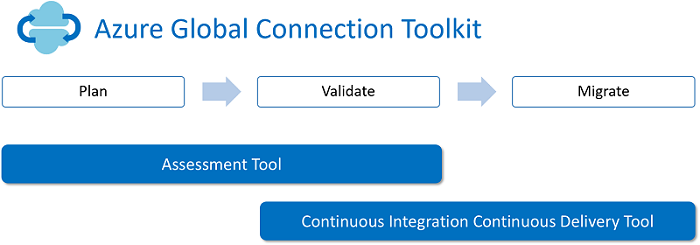

<properties
	pageTitle="Global Customer Playbook migration-assistant"
	description="Global Customer Playbook migration-assistant"
	services="global-customer-playbook"
	documentationCenter=""
	authors="jtong"
	manager="edwinc"
	editor=""
	tags="global-customer-playbook"/>

<tags
	ms.service="global-customer-playbook"
	ms.workload=""
	ms.tgt_pltfrm=""
	ms.devlang="na"
	ms.topic="article"
	ms.date="11/21/2016"
	wacn.date="11/21/2016"
	wacn.lang="en" 
	ms.author="jtong"/>

# Migration Assistant

## Global Connection Toolkit

The goal of Azure Global Connection Toolkit is to connect different national clouds and to eliminate the friction to migrate applications between the national clouds.

Typically, migration / integration between different Cloud environment has three phases:

1. Plan: Users need to spend time to investigate what is the difference and cost between different cloud environment. Also, there will be some risks and considerations in new environment. The uncertainty and unfamiliarity will spend lots of time and block the migration. 

1. Validate: Users need to validate if the services are able to run in target environment. Usually we need a PoC or lots of research to understand the limitation and what will it looks like. The difficulty to get and use a trial account also blocks users to move on.

1. Migrate: After planning and validating, users need to investigate how to migrate/clone their current workload into new environment. The complexity of technologies and steps block user to perform a migration.

In order to help users in each step, Azure Global Connection Toolkit offers two components:

- Assessment Tool: Assessment Tool is a quick and simple tool to generate report and answer "Frequent Asked Question" when migrating Azure Services between different environment like service parity, cost estimation and considerations. It is a PowerShell Module and after install you can start assessment your subscription to make sure the plan and validation of migration.

- CICD Tool: CICD (Continuous Integration Continuous Deliver) Tool is a quick and simple tool to validate and perform the actual migration as script base. For example, you can leverage the toolkit to migrate your VMs from East Asia to China East. The toolkit will sync your data and configuration so that everything is as same as original. Moreover, the scripts is open source so you can just integrate into your own DevOps process to perform CICD between Azure Environments

For details, please refer to [Global Connection Toolkit](https://github.com/Azure/AzureGlobalConnectionToolkit)
 
 

## Other Migration Tools

Apart from the Global Connection Toolkit, there are other tools that may help your migration. Please refer to the following for details.
 
 

Go to the [Other Migration Tools](/solutions/global-customer/other-migration-tools/)