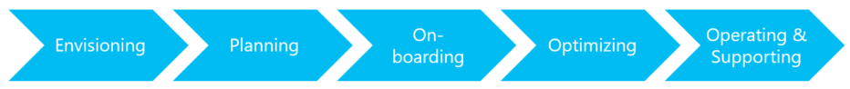

<properties
	pageTitle="Global Customer Playbook migration-lifecycle"
	description="Global Customer Playbook migration-lifecycle"
	services="global-customer-playbook"
	documentationCenter=""
	authors="jtong"
	manager="edwinc"
	editor=""
	tags="global-customer-playbook"/>

<tags
	ms.service="global-customer-playbook"
	ms.workload=""
	ms.tgt_pltfrm=""
	ms.devlang="na"
	ms.topic="article"
	ms.date="11/21/2016"
	wacn.date="11/21/2016"
	wacn.lang="en" 
	ms.author="jtong"/>

# Migration Lifecycle

On migrating your application and/or workload to China Azure, you will have to go through the 5 stages of the lifecycle.
This playbook is structure according to the 5 stages of the lifecycle.

**Envisioning** ([Explore](/solutions/global-customer/envisioning/explore/policies/), 
[Guidance](/solutions/global-customer/envisioning/guidance/policies/), 
[Validate](/solutions/global-customer/envisioning/validate/))
- Understand what needs to be considered
- Identify the constraints and risks
 
**Planning** ([Explore](/solutions/global-customer/planning/explore/policies/), 
[Guidance](/solutions/global-customer/planning/guidance/policies/), 
[Validate](/solutions/global-customer/planning/validate/))
- Plan and design a solution to meet the needs and expectations within the constraints
- Estimate the efforts and formulate a schedule for the migration, including risk management
 
**Onboarding** ([Explore](/solutions/global-customer/onboarding/explore/policies/), 
[Guidance](/solutions/global-customer/onboarding/guidance/policies/), 
[Validate](/solutions/global-customer/onboarding/validate/))
- Provides the solution for the onboarding process when migrating to China Azure
- Includes the execution of the migration, and deployment of the solution
 
**Optimizing** ([Explore](/solutions/global-customer/optimizing/explore/policies/), 
[Guidance](/solutions/global-customer/optimizing/guidance/policies/), 
[Validate](/solutions/global-customer/optimizing/validate/))
- Stabilizing and optimizing the solution on China Azure
- Includes performance testing and system tuning
 
**Operating & Supporting** ([Explore](/solutions/global-customer/operating-supporting/explore/policies/), 
[Guidance](/solutions/global-customer/operating-supporting/guidance/policies/), 
[Validate](/solutions/global-customer/operating-supporting/validate/))
- Cut over the solution into production
- Operate and support the solution on a daily basis
 
 

Let's check the [Structure of the Playbook](/solutions/global-customer/structure-of-playbook/)