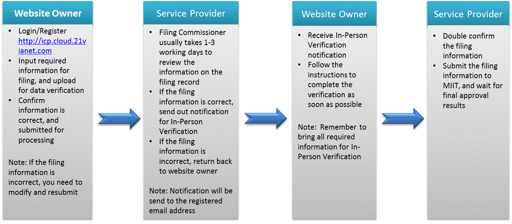

<properties
	pageTitle="Global Customer Playbook onboarding-guidance-policies "
	description="Global Customer Playbook onboarding-guidance-policies"
	services="global-customer-playbook"
	documentationCenter=""
	authors="jtong"
	manager="edwinc"
	editor=""
	tags="global-customer-playbook"/>

<tags
	ms.service="migration-lifecycle-onboarding"
	ms.workload=""
	ms.tgt_pltfrm=""
	ms.devlang="na"
	ms.topic="article"
	ms.date="11/21/2016"
	wacn.date="11/21/2016"
	wacn.lang="en"
	ms.author="jtong"/>

# Onboarding Guidance - Policies

[AZURE.INCLUDE [header](../../../../mktcontent/includes/onboarding-guidance.md)]

## ICP Filing and Application with the Help from 21Vianet

If you host your web sites or services on China Azure, 21Vianet will assist you during the process. For details, please refer to http://icp.cloud.21vianet.com/ and https://www.azure.cn/icp/.

The flow diagram below is the ICP application process:

Let's move to the next section - [Parity](/solutions/global-customer/onboarding/guidance/parity/) .