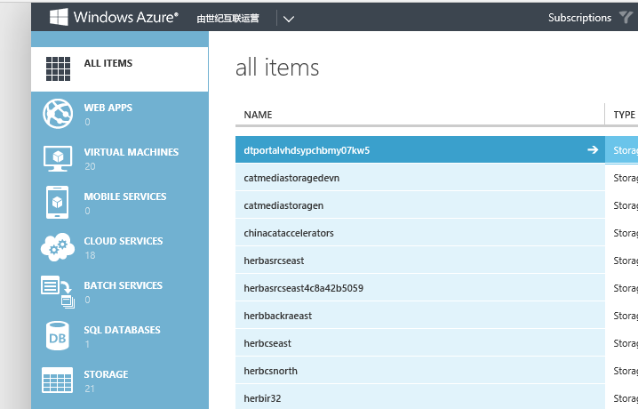
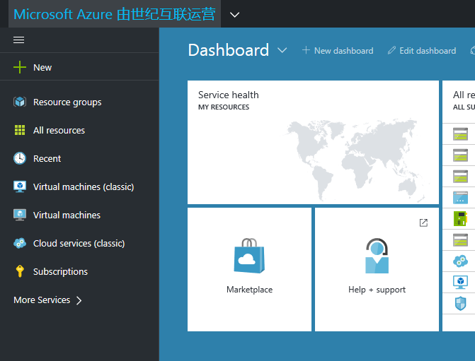

<properties
	pageTitle="Global Customer Playbook onboarding-guidance-parity "
	description="Global Customer Playbook onboarding-guidance-parity"
	services="global-customer-playbook"
	documentationCenter=""
	authors="jtong"
	manager="edwinc"
	editor=""
	tags="global-customer-playbook"/>

<tags
	ms.service="migration-lifecycle-onboarding"
	ms.workload=""
	ms.tgt_pltfrm=""
	ms.devlang="na"
	ms.topic="article"
	ms.date="11/21/2016"
	wacn.date="11/21/2016"
	wacn.lang="en"
	ms.author="jtong"/>

# Onboarding Guidance - Parity

[AZURE.INCLUDE [header](../../../../mktcontent/includes/onboarding-guidance.md)]

## Differences from an Administrator Perspective

Deploying your application and administrating your Azure services on China Azure is similar to what you do on Global Azure. The fundamental difference is the address of the Azure portal. You can access China Azure through either one of the following ways:

- The classic portal ( https://manage.windowsazure.cn/ ),

- The new portal ( https://portal.azure.cn/ ) which is currently available in preview mode.

CDN on China Azure has **its own unified CDN management portal** . This portal will introduce some operational changes to CDN management if you are migrating from the Global Azure CDN. 
Please refer to [Content Delivery Network (CDN) Design](/solutions/global-customer/planning/guidance/rehost-migration/) for details.
 
 

## Global Connection Toolkit

The goal of the Azure Global Connection Toolkit is to connect different national clouds and to eliminate the friction to migrate applications between the national clouds.

Currently, the Global Connection Toolkit offers two components:

- Assessment Tool: Assessment Tool is a quick and simple tool to generate report and answer "Frequent Asked Question" when migrating Azure Services between different environment like service parity, cost estimation and considerations. It is a PowerShell Module and after install you can start assessment your subscription to make sure the plan and validation of migration.

- CICD Tool: CICD (Continuous Integration Continuous Deliver) Tool is a quick and simple tool to validate and perform the actual migration as script base. For example, you can leverage the toolkit to migrate your VMs from East Asia to China East. The toolkit will sync your data and configuration so that everything is as same as original. Moreover, the scripts is open source so you can just integrate into your own DevOps process to perform CICD between Azure Environments

For details, please check out the [Migration Assistant](/solutions/global-customer/migration-assistant/) guide.

Let's move to the next section - [Performance](/solutions/global-customer/onboarding/guidance/performance/) .

