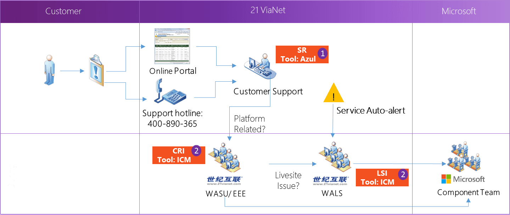

<properties
	pageTitle="Global Customer Playbook operating-supporting-explore-partners "
	description="Global Customer Playbook operating-supporting-explore-partners"
	services="global-customer-playbook"
	documentationCenter=""
	authors="jtong"
	manager="edwinc"
	editor=""
	tags="global-customer-playbook"/>

<tags
	ms.service="migration-lifecycle-operating-supporting"
	ms.workload=""
	ms.tgt_pltfrm=""
	ms.devlang="na"
	ms.topic="article"
	ms.date="11/21/2016"
	wacn.date="11/21/2016"
	wacn.lang="en"
	ms.author="jtong"/>

# Operating And Supporting Explore - Partners

[AZURE.INCLUDE [header](../../../../mktcontent/includes/operating-supporting-explore.md)]

## Operation and Support

21Vianet provides the first line for support services for all Mooncake customers. The following information below illustrates the operation and support workflow.
 
Customer are expected to raise a service request (SR) through the China Azure online portal or the support hotline 400-890-365.

### Operation and Support Workflow

### Terms and Definitions

**SR**: *Service Request* - A problem in Azure that is reported to the support team.

**CRI**: *Customer Reported Incident* - A problem in Azure that is reported to the support team by a customer and has to be resolved by the Engineering Group.

**LSI**: *Live Site Incident* - Any event in production that has an impact on customers, such as a complete site outage, latency increase, feature availability, or brand impact. There are two sources reported by customers: service auto-alert or CRI.

### SR Severity 

**Severity** | **Customer Situation** | **Expected 21V Response Time** | **Expected Customer Response**
------------ | ------------ | ------------ | ------------
A | Critical business impact | Initial Response: 2 hours or less, continuous work all day until the problem is resolved | Allocate the appropriate resources to maintain continuous work all day until the problem is resolved, provide accurate contact information for case owners
B | Medium business impact | Initial Response: 4 hours or less, continuous work all day, unless the customer requests to exit | Allocate the appropriate resources to maintain continuous work, unless the customer requests to exit, provide accurate contact information for case owners
C | Low business impact | Initial Response: 8 hours or less | Provide accurate contact information for case owners

### CRI & LSI Severity 

**Severity** | **Impact** | **Details** 
------------ | ------------ | ------------
0 | Disaster | Irrecoverable data loss or data corruption for two or more customers due to platform defect or security incident
1 | Multi-service or Multi-Region | Major scenario impacting 2 or more customers in multiple regions
2 | Single-service | Major scenario below SLA for a single Azure branded service
3 | Urgent or high business impact w/no SLA impact | Immediate operations engagement, all escalations occur during business hours (or immediately per TSG)
4 | Not urgent, no SLA impact | Incidents will be worked FIFO and assigned to the component triage queue if the TSG fails or does not exist.

For more details about the support plan, please visit: https://www.azure.cn/support/plans/.

You have completed exploration.

