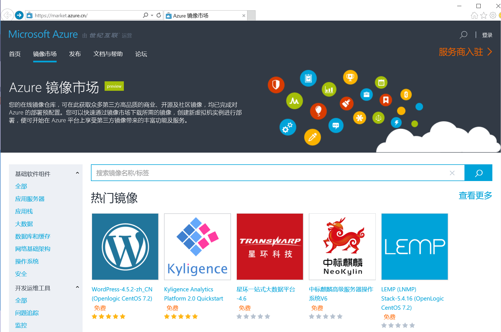

<properties
	pageTitle="Global Customer Playbook planning-explore-partners "
	description="Global Customer Playbook planning-explore-partners"
	services="global-customer-playbook"
	documentationCenter=""
	authors="jtong"
	manager="edwinc"
	editor=""
	tags="global-customer-playbook"/>

<tags
	ms.service="migration-lifecycle-planning"
	ms.workload=""
	ms.tgt_pltfrm=""
	ms.devlang="na"
	ms.topic="article"
	ms.date="11/21/2016"
	wacn.date="11/21/2016"
	wacn.lang="en"
	ms.author="jtong"/>

# Planning Explore - Partners

[AZURE.INCLUDE [header](../../../includes/planning-explore.md)]

## Cloud Operation Partner - 21Vianet

**1. Service Level Agreement**

China Azure, operated by 21Vianet, offers similar service standard and service level agreements for Global Azure.
 
For services standard agreements, please refer to: https://www.azure.cn/support/legal/subscription-agreement/.
 
For service level agreements for all Azure Services, please refer to:
https://www.azure.cn/support/legal/sla/.

**2. Trust Center**

The Trust Center for China Azure provides all the information you need regarding security, compliance, privacy, and transparency.
 
You can find the details at https://www.trustcenter.cn/ and https://www.azure.cn/zh-cn/support/trust-center/.

**3. Compliance**

To help you and your company comply with national, regional, and industry-specific requirements governing the collection and use of individuals’ data, 21Vianet offers a comprehensive set of certifications and attestations.
 
21Vianet accomplishes this breadth of compliance offerings with a two-pronged approach:

- First, a team of 21Vianet experts works with our engineering and operations teams, as well as external regulatory bodies, to track existing standards and regulations, developing hundreds of controls for the product teams to build into our cloud services.
- Second, because regulations and standards are always evolving, our compliance experts also anticipate upcoming changes to help ensure continuous compliance - researching draft regulations, assessing potential new requirements, and developing corresponding controls.
 
For a detailed list of regulations and standards compliance, please refer to: https://www.trustcenter.cn/en-us/compliance/.
 
For details on law compliance, please check the subscription agreement and privacy statement listed below:
https://www.azure.cn/support/legal/subscription-agreement
https://www.azure.cn/support/legal/privacy-statement
 
**4.Trial Account and the $1 Plan**

To give you an opportunity to try our services on China Azure, we are offering a $1 trial subscription plan. It is designed to provide you with an opportunity to experience China Azure services. You only need to pay one yuan (RMB), and you get $1,500 in credit to access Azure services, which is valid for one month.
 
You can use this credit to try Azure services on China Azure. For details, please click on this link: https://www.azure.cn/offers/ms-mc-azr-44p/.
 
If you need an English translation, please use this [translated link](https://translate.google.com.hk/translate?hl=zh-CN&sl=zh-CN&tl=en&u=https%3A%2F%2Fwww.azure.cn%2Foffers%2Fms-mc-azr-44p%2F).
 
 

## Azure Solution Partners

**1. Availability of Global Partner Solutions**

On Global Azure, you have the Global Partner Solutions available at the Azure Marketplace (https://azure.microsoft.com/en-us/marketplace/), which is your online store for thousands of certified, open-source and community software applications, developer services, and data — pre-configured for Microsoft Azure. 
 
However, these solutions are pre-configured for Global Azure, not for China Azure. For any solution that you have used in your Global Azure deployment, you have to find a replacement when you migrate to China Azure.

**2. Local China Partner Solutions**

You can find a list of certified partners for China Azure at https://www.azure.cn/partnerancasestudy/partner/. Here, they can help you find localized partner solutions based on your requirements.

There is a Marketplace in China Azure, similar to the Global Azure Marketplace, which is currently in Public Preview at https://market.azure.cn/. The China Azure Marketplace is an online store for highly optimized and integrated applications and services ready to deploy on China Azure. The following screenshot is the public preview of the China Azure Marketplace.

**3. Case Studies on China Azure**

There are many customer case studies regarding China Azure which you can use as a reference, they are listed according to industry, solution, and services.
 
Please visit https://www.azure.cn/partnerancasestudy/case-studies/ for more details.
 
 

Let's move to the next stage - [Onboarding Stage](/solutions/global-customer/onboarding/explore/policies/).

