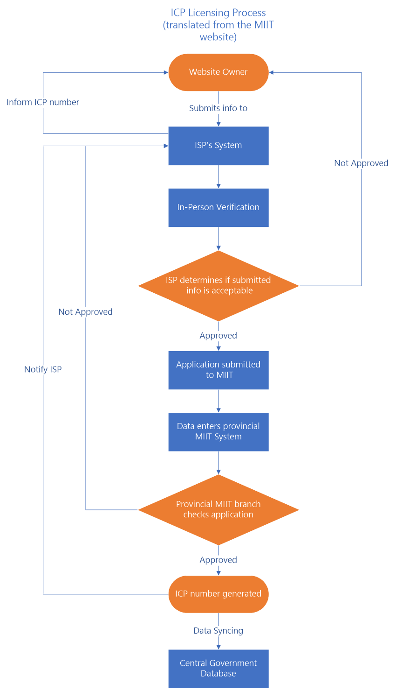

<properties
	pageTitle="Global Customer Playbook planning-guidance-policies "
	description="Global Customer Playbook planning-guidance-policies"
	services="global-customer-playbook"
	documentationCenter=""
	authors="jtong"
	manager="edwinc"
	editor=""
	tags="global-customer-playbook"/>

<tags
	ms.service="migration-lifecycle-planning"
	ms.workload=""
	ms.tgt_pltfrm=""
	ms.devlang="na"
	ms.topic="article"
	ms.date="11/21/2016"
	wacn.date="11/21/2016"
	wacn.lang="en"
	ms.author="jtong"/>

# Planning Guidance - Policies

[AZURE.INCLUDE [header](../../../includes/planning-guidance.md)]

## ICP Website Filing and Registration Process

Below is a flowchart summarizing the process for filing and applying for an ICP license from MIIT.

 
The Ministry of Industry and Information Technology issues two different types of [ICP numbers](https://en.wikipedia.org/wiki/ICP_license), which are managed at the provincial level.

- **ICP license** for commercial websites, which cover any website offering goods or services to customers. These numbers follow the format 京ICP证12345678号 (in this example, " 京" represents Beijing).
- **ICP filing** for non-commercial websites which are purely informational and are not involved in direct sales. These numbers follow the format 京ICP备12345678号(in this example, "京 " represents Beijing).

The following entities may apply for a ICP:

- Chinese-owned businesses with a Chinese business license can apply for a Business ICP
- Partially or wholly foreign-owned (non-Chinese) businesses with any type of Chinese business license (Joint-Venture or WOFE, for example), can apply for a Business ICP
- Chinese nationals, using their state-issued ID, can apply for an Individual ICP, Foreign (non-Chinese) individuals, using their passport as ID, who can be physically present in China long enough to fulfill some basic registration requirements, can apply for an Individual ICP

The following entities may not apply for an ICP:

- Foreign businesses with no legal business presence in China
- Foreign individuals without a passport (and who are therefore ideally not residing in China)

Once the process has started, MIIT, via your web host, will assess your status as an individual or corporation, verify your identity, check your proposed website content for any sensitive political issues, and may ask to see your business license before issuing an ICP. The process typically takes an average span of **20 business days** after submitting the documents to the hosting provider, and your hosting provider usually helps you to handle your application.

If the documents are deemed valid upon review by the provider, they are forwarded onto the MIIT for further review. If at either stage the documents are rejected, the applicant is required to submit additional documents, therefore it would be better to plan for the ICP process **2 months ahead of time** .
 
 

Let's move to the next section - [Parity](/solutions/global-customer/planning/guidance/parity/).

