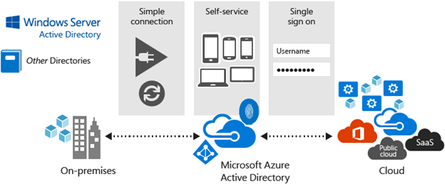
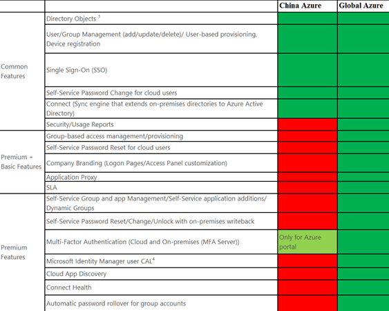
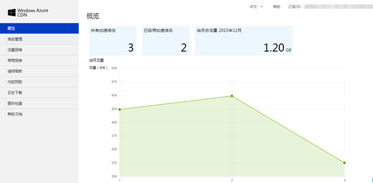
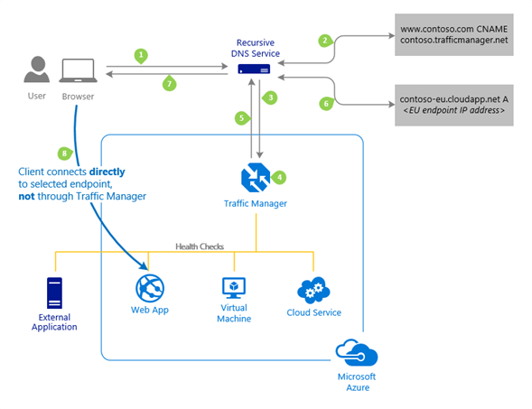
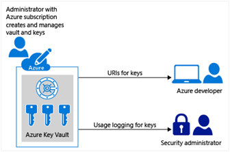

<properties
	pageTitle="Global Customer Playbook planning-guidance-rehost-migration "
	description="Global Customer Playbook planning-guidance-rehost-migration"
	services="global-customer-playbook"
	documentationCenter=""
	authors="jtong"
	manager="edwinc"
	editor=""
	tags="global-customer-playbook"/>

<tags
	ms.service="migration-lifecycle-planning"
	ms.workload=""
	ms.tgt_pltfrm=""
	ms.devlang="na"
	ms.topic="article"
	ms.date="11/21/2016"
	wacn.date="11/21/2016"
	wacn.lang="en" 
	ms.author="jtong"/>

# Rehost Migration Scenarios

In most cases, you already have your applications deployed to Global Azure, and would like to redeploy it to a different cloud environment - the China Azure. The following serve as a guide on how to orchestrate the migration design for your applications or workload that runs on Global Azure, and to have them migrated to China Azure.
 
 

## Azure Active Directory (AAD) Design

Azure Active Directory (AAD) is Microsoft’s multi-tenant cloud-based directory and identity management service. It is a comprehensive identity and access management cloud solution that provides a robust set of capabilities to manage users and groups. It helps secure access to on-premises and cloud applications, and it enables single sign-on to simplify user access to cloud applications from Windows, Mac, Android, and iOS devices. 

The following illustration shows the design of the AAD identity management service. For further details, please refer to https://azure.microsoft.com/en-us/documentation/articles/active-directory-whatis/.

The AAD service is available on China Azure. However, it is a dedicated AAD service for China Azure, and is exclusively for users accessing applications on China Azure. There is no synchronization service for the AAD identities between Global Azure and China Azure.
 
Currently, AAD Premium, AAD B2C, and AAD Domain Services are not yet available on China Azure. If your application needs any of these AAD services, you will have to find alternative solutions as a replacement. The following table summarizes the AAD features (in green color) currently available on China Azure.

### AAD B2C and Social IdP
 
For Global Azure, AAD B2C offers a Social Identity Provider for integration with popular social networks like Facebook, Google+, LinkedIn, and Amazon. However, as described in the Appendix (Top Things to Know About Entering the China Market), these social networks are blocked in China. You’ll need to have a social marketing strategy specifically tailored to the social networks in China, e.g. WeChat, Sina Weibo, etc. 
 
For China Azure, the Social Identity Provider for WeChat and Weibo is still in the under consideration, and there has not been an announced schedule for the releases. 
 
However, the China Customer Advisory Team (CAT) has been working on many Azure solutions for integration with WeChat. If you need help on development guidance, please contact your Microsoft account representatives.
 
 

## Content Delivery Network (CDN) Design

Ensuring that a consistent user experience is very important to us, let alone any company. If your websites or mobile apps involve streaming media, gaming software, firmware updates (Smart TVs, consumer electronic appliances) or IoT endpoints (cars, sensors), the Content Delivery Network (CDN) helps you reduce load times, save bandwidth, and increase responsiveness. For more details on the Azure CDN, please refer to this link https://azure.microsoft.com/en-us/documentation/articles/cdn-overview/.
 
With Global Azure, Azure CDN offers choices from Akamai and Verizon. However, with China Azure, the Azure CDN service is provided by a different set of CDN providers, strictly **by local China CDN providers**. Currently, there are 3 local CDN providers on boarded with China Azure - Webluker from ChinaCache, [ChineNetCenter](http://www.chinanetcenter.com/) and [Fastweb](http://www.fastweb.com.cn/) - and there are plans to have more CDN providers to be integrated with China Azure in the future. 

The following are a couple of points worth taking into consideration regarding the CDN service on China Azure:
 
- Similar to other services on China Azure, the Azure CDN service is supported by 21Vianet. You will not need to contact the local CDN providers for support. 21Vianet provides the single point of contact for all China Azure services support including the CDN.
 
- CDN on China Azure has **its own unified CDN management portal** , for further details you can check the document [here](https://www.azure.cn/documentation/articles/cdn-management-portal-how-to-use/) . The CDN management portal will introduce some operational changes to CDN management if you are migrating from the Global Azure CDN.

 
 

## Traffic Management Design
 
Azure Traffic Manager enables you to control how traffic is distributed across your application endpoints. An endpoint can be any Internet-facing endpoint, hosted in Azure or outside Azure. Traffic Manager uses DNS to direct end users to particular service endpoints, based on the chosen traffic-routing method and the health of the current endpoint. 
 
The illustration below explains how the Traffic Manager works. For more details, please refer to: https://azure.microsoft.com/en-us/documentation/articles/traffic-manager-how-traffic-manager-works/

Traffic management on China Azure is similar to Global Azure, it supports endpoints for Azure VMs, Azure Web Apps, or other Azure services, and external endpoints not hosted on Azure.  Please check out https://www.azure.cn/documentation/articles/traffic-manager-endpoint-types/ for details. If you may need an English translation follow this [link](https://translate.google.com.hk/translate?hl=zh-CN&sl=zh-CN&tl=en&u=https%3A%2F%2Fwww.azure.cn%2Fdocumentation%2Farticles%2Ftraffic-manager-endpoint-types%2F).
 
However, **the endpoints have to be within China**, and the Azure service endpoints should be hosted in either one of the two datacenters in China Azure, namely the China East or the China North datacenter. You have to pay attention to these endpoint characteristics when you are designing traffic management for your applications on China Azure.

In case you have an application hosted on Global Azure and are deploying another one to China Azure to serve  users in China, you can have your Traffic Manager setup in Global Azure and have the traffic routed to the site hosted on China Azure. If you are expecting your users to be travelling around the world and you configure the Traffic Manager with the performance traffic-routing method, you will see an improvement in the responsiveness of your application with Traffic Manager routing your users to the location that is ‘closest’ to them, as measured by the lowest network latency. The prerequisite for this solution is to synchronize the user data between your applications hosted on Global Azure and China Azure.
 
For details on the performance traffic-routing method, please refer to
https://azure.microsoft.com/en-us/documentation/articles/traffic-manager-routing-methods/#performance-traffic-routing-method.
 
 

## Push Notification Design

Azure Notification Hubs provide an easy-to-use, multiplatform, scaled-out push infrastructure that enables you to send mobile push notifications from any backend (in the cloud or on-premises) to any mobile platform. With Notification Hubs you can easily send cross-platform, personalized push notifications, while abstracting the details of the different platform notification systems (PNS). With a single API call, you can target individual users or entire segments of an audience potentially containing millions of users across all their devices.
 
The following illustration reveals how push notification works. For more details, please refer to: https://azure.microsoft.com/en-us/documentation/articles/notification-hubs-push-notification-overview/.

With Global Azure, the Notification Hub works with APNS (Apple Push Notification Services), GCM (Google Cloud Message), WNS (Windows Push Notification Services) and MPNS (Microsoft Push Notification Service). 
 
However, with China Azure, the Notification Hub works differently for PNS. For **Android devices, it's via the Baidu Push PNS** (where notifications are sent to mobile devices in China), which is the target for the China Market. You have to pay attention to the difference in PNS when you are designing the push notification for your applications on China Azure.
 
If users have pretty stable locations when accessing your application, users in China can always access your application that is hosted in China Azure. They will also be able to receive notifications through the China Notification Hub. On the other hand, if your users are travelling around the world, you may need to think of using a dynamic routing solution (e.g. the Traffic Manager using the performance traffic-routing method), so that when users travel outside of China, they will be routed to your application hosted on Global Azure, instead of the one hosted on China Azure.  The prerequisite for this solution is to synchronize the user data between your applications hosted on Global Azure and China Azure.
 
 

## Secure Key Management Design
 
Secure key management is essential to protecting data on the cloud. With Azure Key Vault, you can safeguard cryptographic keys and secrets used by cloud applications and services. By using Key Vault, you can encrypt keys and secrets (such as authentication keys, storage account keys, data encryption keys, .PFX files, and passwords). Key Vault streamlines the key management process and enables you to maintain control of keys that access and encrypt your data. Developers can create keys for development and testing in minutes, and then seamlessly migrate them to production keys. Security administrators can grant (and revoke) permission to keys, as needed, as illustrated in the following diagram.

You can find more details on Azure Key Vault by clicking on https://azure.microsoft.com/en-us/documentation/articles/key-vault-whatis/ or
https://www.azure.cn/documentation/articles/key-vault-whatis/ .
 
On Global Azure, for added assurance, you can import or generate keys in hardware security modules (HSMs). However, on China Azure, **there is no HSM offered** for you to manage keys. Therefore, you have to pay attention to this difference when you are designing the secure key management for your applications on China Azure.
 
 

## Extending Cloud Connectivity

To extend the cloud connectivity of your Azure applications or workloads, it is advised to form a hybrid cloud solution that is connected to your on-premises resources. This method is quite similar to Global Azure and provides you with two options: the Virtual Private Network (VPN) or the Express Route (ER). Within China, you can have a VPN or Express Route setup for your hybrid cloud, with direct network connection between China Azure and your on-premises private cloud and/or back-end systems.

The other extension on cloud connectivity that you may consider will be to connect your applications on Global Azure to your applications on China Azure. According to this perspective, you are considering linking the connectivity to an external site (in Global Azure), outside of China. However, this kind of direct network connectivity is not possible through express route, even between Global Azure and China Azure.  As an alternative solution, you can consider setting up a site-to-site VPN between the external site - whether or not it is on Global Azure - with your site on China Azure. 

In either case, having a VPN/express route setup that is connected to your services on China Azure (i.e. your ICP registered hosting location to an outside location) you will need to register, report, and obtain for approval from MIIT. As a reminder, 21Vianet will assist in the approval process.
 
 

Let's move to the next section - [Performance](/solutions/global-customer/planning/guidance/performance/).

