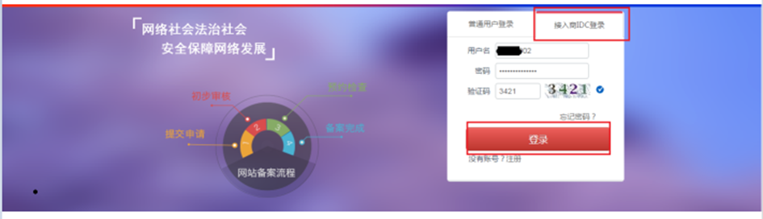
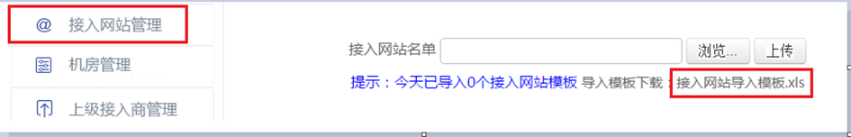
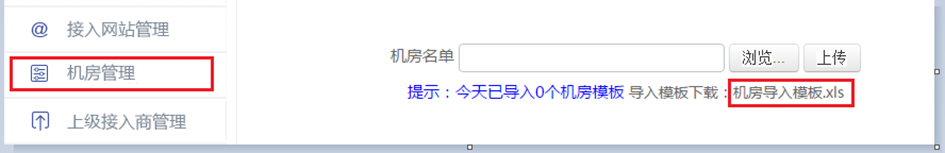
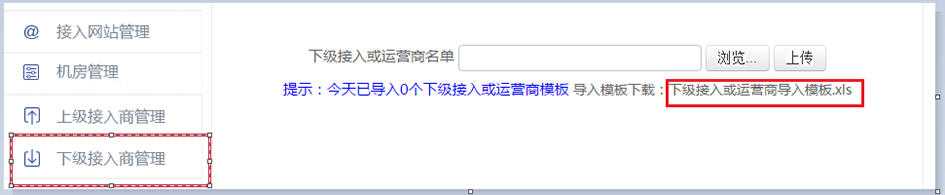

<properties
	pageTitle="用户操作手册 | Azure"
	description=" 全国公安机关互联网站安全服务平台 IDC 用户操作手册"
	services="public-security-registration"
	documentationCenter=""
	authors="will"
	manager="edwinc"
	editor=""
	tags="public-security-registration"/>

<tags
	ms.service="public-security-registration"
	ms.workload=""
	ms.tgt_pltfrm=""
	ms.devlang="na"
	ms.topic="article"
	ms.date="03/2017"
	wacn.date="03/2017"
	wacn.lang="cn" 
	ms.author="will"/>

# 全国公安机关互联网站安全服务平台 IDC 用户操作手册

### IDC 前端页面操作指南

1)注册

在地址栏输入[www.beian.gov.cn](http://www.beian.gov.cn)，进入全国公安机关互联网络安全管理服务平台，点击“接入商 IDC 登录”，在点击下面“注册” ，跳转到注册页面。

 

输入正确的用户名、密码、邮箱、手机号、验证码和手机验证码后，点击注册。注册完成跳转到登陆页面。

2)登陆

点击“接入商 IDC 登录”，输入注册时填写的用户名和密码，进入管理页面。

 

3) IDC 主体信息填写 

进入网站后，提示“填写 IDC 信息”，点击“进入”。

 

按照规范，真实填写 IDC 的信息。证件照片按照要求上传图片。以便于审核。填写完成后点击“提交审核”，IDC 信息填写完成。

 

4)接入网站管理

IDC 信息填写完成后，点击“接入网站管理”，点击“接入网站导入模板”。

 

模板下载之后，按照模板要求进行填写。填写完成后，点击“浏览”，选择填写完成的文件，点击“上传”，等待上传成功后，提示上传成功，即完成上传，等待审核即可。

5)机房管理

IDC 信息填写完成后，点击“机房管理--机房导入模板”。

 

模板下载之后，按照模板要求进行填写。填写完成后，点击“浏览”，选择填写完成的文件，点击“上传”，等待上传成功后，提示上传成功，即完成上传，等待审核即可。

6)上级接入商管理

IDC 信息填写完成后，点击“上级接入商管理--上级接入或运营商导入模板”。 

 

模填写完成的文件，点击“上传”，等待上传成功后，提示上传成功，即完成上传，板下载之后，按照模板要求进行填写。填写完成后，点击“浏览”，选择等待审核即可。

7)下级接入商管理

IDC 信息填写完成后，点击“下级接入商管理--下接入或运营商导入模板”。 

 

模板下载之后，按照模板要求进行填写。填写完成后，点击“浏览”，选择填写完成的文件，点击“上传”，等待上传成功后，提示上传成功，即完成上传，等待审核即可。

8)IP 段管理

IDC 信息填写完成后，点击“IP 段管理--IP 段导入模板”。

 

模板下载之后，按照模板要求进行填写。填写完成后，点击“浏览”，选择填写完成的文件，点击“上传”，等待上传成功后，提示上传成功，即完成上传，等待审核即可。

